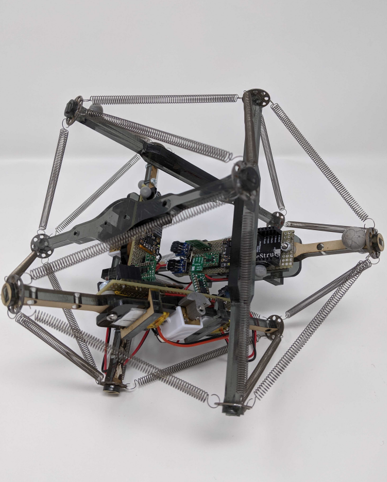
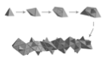

As a professor at a small liberal arts college, my interest is in research projects which allow to mentor and train my students as robotics researchers.

## Tensegrity Robotics

Tensegrities are relatively simple mechanical systems, consisting of a number of rigid elements (struts) joined at their endpoints by tensile elements (cables or springs), and kept stable through a synergistic interplay of pre-stress forces. Beyond engineering, properties of tensegrity have been demonstrated at all scales of the natural world, ranging from the tendinous network of the human hand to the mechanotransduction of a living cell. 

Our research focuses on leveraging the inherent dynamical complexity of tensegrities to create robust soft robots that move in interesting ways.

Selected highlights:
* Rieffel, John, and Jean-Baptiste Mouret. "Adaptive and resilient soft tensegrity robots." Soft robotics 5.3 (2018): 318-329.
* Lehmann, Lukas, et al. "Investigation of stiffness and mechanical property change capabilities of compliant 2D tensegrity grids for the application in soft robotics." 2025 IEEE 8th International Conference On Soft Robotics (RoboSoft). IEEE, 2025.
* Doney, Kyle, et al. "Behavioral repertoires for soft tensegrity robots." 2020 IEEE Symposium Series on Computational Intelligence (SSCI). IEEE, 2020.
  
We also curate the [Tensegrity Robotics Webpage](tensegrity-robotics.github.io), a repository of tensegrity robotics research.

## Soft Robotics

Soft Robotics seeks bio-inspired approaches to building robots out of soft and flexible materials.   

Our lab's research has involved using 2D volumetric (voxel) simulators like EvoGym and 2D_VSR to develop soft robotic gaits and behavioral repertoires driven by central pattern generators and spiking neural networks.

## Evolutionary Fabrication

  Soft robots systems are very difficult for humans to design and manufacture because of their material complexity. This project aims to develop a proof-of-concept robotic factory, EvoFab, for the automated design, fabrication, and testing of novel soft actuators. EvoFab combines innovative evolutionary simulations that test and iterate on millions of potential solutions with fully automated fabrication and in-situ characterizing to design, manufacture, and test air pressure-powered soft actuators.
  

